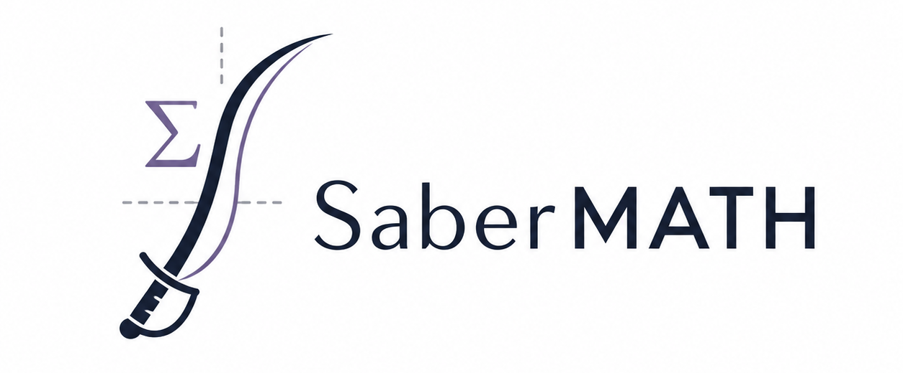

<div align="center">
  
</div>

# SABER-Math

SABER-Math (**S**calable **A**utomated **B**enchmark for **R**eranking in **Math**) is a benchmark for evaluating information retrieval and reranking systems on mathematics. It is designed to test whether a retriever can find solved problems that are mathematically useful for a query problem, rather than only textually similar.

The benchmark focuses on informal mathematical retrieval over high-school, olympiad, and early-undergraduate-style problems. Each query is paired with a fixed set of candidate documents, and every candidate has a fine-grained relevance score. The main evaluation setting is **statement-full**: the query contains only the problem statement, while each retrieved document contains a problem statement together with its solution.

## Installation

SABER-Math requires Python 3.10 or newer. Python 3.11 or newer is recommended.

```bash
git clone <repo-url>
cd sabermath

python -m venv .venv
source .venv/bin/activate
python -m pip install --upgrade pip
python -m pip install -e .
```

Optional extras are available for different retriever backends:

```bash
# vLLM-backed embedding models
python -m pip install -e ".[vllm]"

# OpenAI and Gemini embedding APIs
python -m pip install -e ".[apis]"

# Lexical baselines: TF-IDF, BM25, Jaccard, Approach Zero
python -m pip install -e ".[lexical]"

# Custom-scoring rerankers: rank1, Qwen3-Reranker, ColBERT, ReasonIR, SPLADE
python -m pip install -e ".[rerankers]"

# The analyses and figures under scripts/analysis/ and scripts/plots/
python -m pip install -e ".[analysis]"

# Everything
python -m pip install -e ".[vllm,apis,lexical,rerankers,analysis]"
```

For API-based models, set the relevant API key before running evaluation:

```bash
export OPENAI_API_KEY=<your-openai-api-key>
export GEMINI_API_KEY=<your-gemini-api-key>
# GOOGLE_API_KEY is also supported for Gemini.
```

## Running the benchmark

The package exposes a simple Python API through `sabermath.evaluate`. By default, it loads the benchmark datasets from Hugging Face:

- `INSAIT-Institute/SaberMath-queries`
- `INSAIT-Institute/SaberMath-documents`

### Python API

```python
import json
import sabermath

report = sabermath.evaluate(
    "BAAI/bge-m3",
    tasks=["statement-full"],
    k=10,
    dcg_variant="exponent",
)

print(report)
print(json.dumps(report.to_dict(), indent=2))
```

The available tasks are:

| Task | Query text | Document text |
|---|---|---|
| `statement-statement` | problem statement | problem statement |
| `statement-full` | problem statement | problem statement + solution |
| `full-full` | problem statement + solution | problem statement + solution |

If `tasks` is omitted, all three tasks are evaluated. The returned report contains the overall nDCG@k score and per-domain scores for Algebra, Geometry, Number Theory, Combinatorics, and Calculus and Analysis. The default value of `k` is `10`.

### Command-line runner

Evaluation runs through one endpoint, `scripts/run_experiments.py`. It takes model keys from the registry (`src/sabermath/registry.py`) rather than HF ids, because each model carries its own processor recipe and vendor input protocol:

```bash
# list every available model key
python scripts/run_experiments.py --list

# every model, no instruction - reproduces the main tables
python scripts/run_experiments.py

# a subset
python scripts/run_experiments.py --models bge-m3 qwen3-reranker-4b

# one task, one model
python scripts/run_experiments.py --models rank1-7b --task statement-full

# smoke test on 20 random queries before committing to a full run
python scripts/run_experiments.py --models rank1-32b --n 20

# the instruction ablation: four instructions, sharing one loaded model
python scripts/run_experiments.py --prompts p0 p1 p2 p3
```

`--models` defaults to every model in the registry and `--prompts` defaults to `p0` ("no instruction"). Results are written to `results/evaluation/<model>__<prompt>.json`, checkpointed after every query.

Most models share one environment (`scripts/envs/env_vllm.yml`), but four families contain conflicts which can tank performance or make the runs crash. These families need their own configs, as described in [docs/experiment-evaluation.md](docs/experiment-evaluation.md) and the files in `scripts/envs/`. 

The other endpoints follow the same shape, each with `--models` defaulting to all:

| Endpoint | Experiment | Write-up |
|---|---|---|
| `scripts/run_experiments.py` | nDCG evaluation: main tables and the instructions | [evaluation](docs/experiment-evaluation.md), [instructions](docs/experiment-instructions.md) |
| `scripts/run_dedup.py` | Where a rephrased copy of a query's own problem ranks | [dedup](docs/experiment-dedup.md) |
| `scripts/run_timing.py` | Per-query latency on production backends | [timing](docs/experiment-timing.md), [latency](docs/experiment-latency.md) |
| `scripts/report_experiments.py` | Regenerates every table into `results/tables/` | [overview](docs/experiments-overview.md) |

A slow model can be split across concurrent jobs with `--query-shards N --query-shard I` and stitched back with `--merge-shards`; see [docs/experiment-evaluation.md](docs/experiment-evaluation.md).

## Recreating the benchmark

The `build_benchmark/` directory contains the code for recreating SABER-Math from the raw problem-solution databank.

The directory has its own `README.md` with the full step-by-step instructions.

Important subdirectories:

| Path | Purpose |
|---|---|
| `build_benchmark/annotate/` | LLM-based tag extraction, solution-idea extraction, and postprocessing. |
| `build_benchmark/similarities/` | Topic-similarity and solution-summary similarity computation. |
| `build_benchmark/fastbma/` | C extension for faster Best-Match Average topic similarity. |
| `build_benchmark/select/` | Target and candidate selection scripts. |
| `build_benchmark/generate_scores/` | Swiss tournament judging and Bradley-Terry relevance scoring. |
| `build_benchmark/final_transform.py` | Final score transformation before publishing the benchmark dataset. |

See `build_benchmark/README.md` for the exact environment variables, commands, Hugging Face dataset paths, and configuration files.

## Repository layout

| Path | Contents |
|---|---|
| `src/sabermath/` | The benchmark package: `evaluate`, processors, metrics |
| `src/sabermath/registry.py` | Every model key, its processor recipe, its input protocol |
| `src/sabermath/runner.py` | Running one (model, prompt) cell, with checkpointing |
| `src/sabermath/results.py` | Reading `results/`: filename grammar and protocol precedence |
| `src/sabermath/tables.py` | Shared table-building: reading runs into rows, model metadata |
| `src/sabermath/shards.py` | Splitting one run across jobs, and stitching it back |
| `scripts/` | Every entrypoint, and nothing else — the package itself is import-only |
| `scripts/analysis/` | Standalone analyses: rescaling robustness, MTEB correlation, confidence intervals, dedup and math-vs-word |
| `scripts/plots/` | Every figure: latency-vs-quality, math-vs-word, benchmark composition |
| `scripts/tables/` | Table generators, one module per table, run by `report_experiments.py` |
| `scripts/envs/` | The five conda environments, one per conflicting pin set |
| `results/` | Every result (see below) |
| `docs/` | Per-experiment write-ups and protocol notes (see [Documentation](#documentation)) |

### `results/`

| Path | Contents |
|---|---|
| `results/evaluation/` | Every nDCG run, `<model>__<prompt>.json` |
| `results/timing/` | Per-query latency |
| `results/dedup/` | Deduplication rankings |
| `results/confidence/` | Bootstrap confidence intervals |
| `results/rescaled/`, `results/rescaling/` | Relevance-rescaling robustness |
| `results/math_vs_word/` | Similarity dumps, figures, and the per-instruction table |
| `results/latency/` | Latency-vs-quality figure data |
| `results/diagnostics/` | Backend-equivalence verdicts |
| `results/tables/` | Generated tables |

Regenerate every table with:

```bash
python scripts/report_experiments.py
```

## Documentation

[`docs/experiments-overview.md`](docs/experiments-overview.md) contains more thorough information on how to run the experiments and what each script entrypoingt does. The remaining `docs/experiment-*.md` files cover one experiment each, including prerequisites, the commands, and the output files.

## License

This project is licensed under the Creative Commons Attribution-ShareAlike 4.0 International License (CC BY-SA 4.0).

You are free to share and adapt the material, provided that appropriate credit is given and any derivative works are distributed under the same license.

## Citation

```bibtex
@inproceedings{
  georgiev2026sabermath,
  title={{SABER}-Math: An Automated Reranking Benchmark for Mathematical Information Retrieval},
  author={Anonymous},
  booktitle={The 2026 Conference on Empirical Methods in Natural Language Processing},
  year={2026},
  url={https://openreview.net/forum?id=Tb2EKLtAS0}
}
```